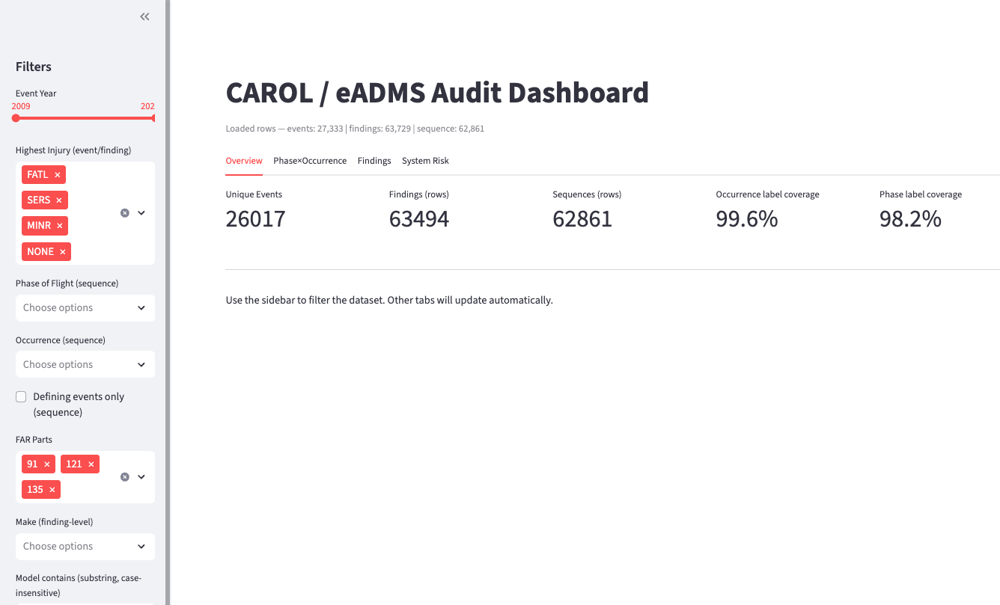
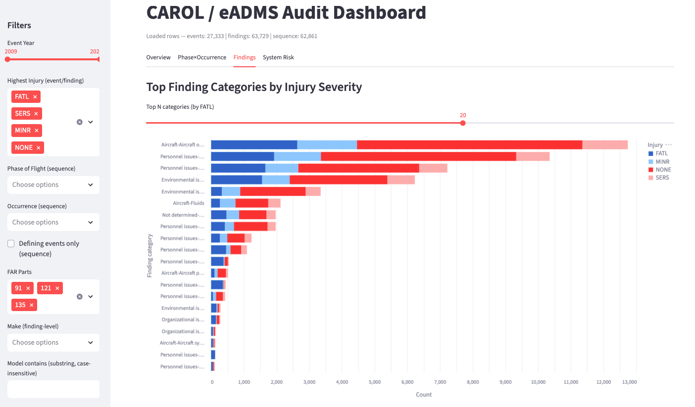
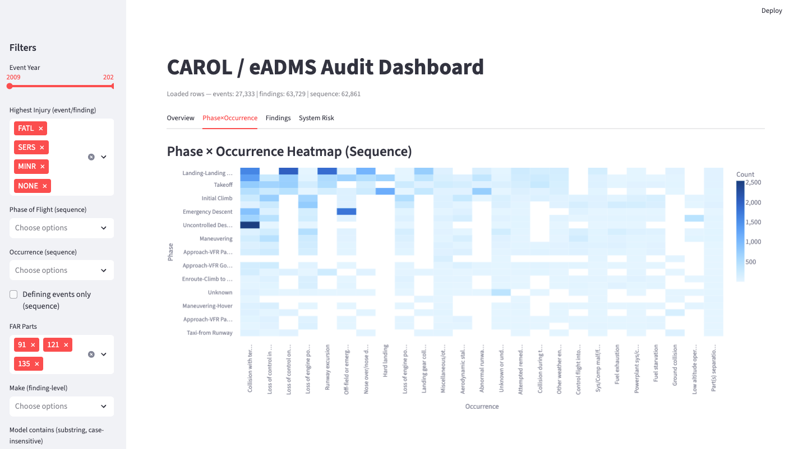
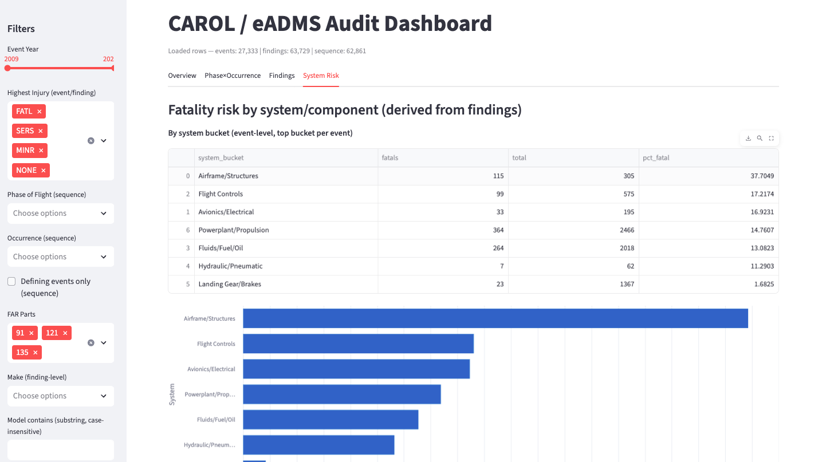

# RSCH650 - NTSB/CAROL Accident Analytics (Streamlit)


A **Streamlit app** and **data pipeline** for analyzing NTSB/CAROL accident data.
This project supports **aviation safety research** for the RSCH 650 course by providing **reproducible analytics**, **statistical summaries**, and **interactive visualizations**.

---

## ✈️ Focus Areas

- Event-level accident trends (year, severity, make/model)
- Phase x Occurrence cross-tabs from the NTSB sequence table
- Finding-level analysis with derived **system buckets** (e.g., Flight Controls, Powerplant, Hydraulics)
- Risk statistics: **chi-square** and **odds ratio** summaries (Flight Controls vs. other systems)

---

## 🚀 Quick Start

```bash
# 1) Create a virtual environment (or use `make venv`)
python3 -m venv .venv
source .venv/bin/activate

# 2) Install dependencies
python -m pip install -U pip
pip install -r requirements.txt

# 3) Build Parquets from CAROL CSVs (place raw CSVs under data/raw)
make build

# 4) Launch the app
make run  # or: streamlit run app.py
```

---

## 📂 Project Layout

```plaintext
.
├── app.py                     # Streamlit UI
├── main.py                    # Pipeline: raw CSVs → Parquet
├── analysis/
│   └── system_risk.py         # System-bucket logic & 2x2 stats
├── loaders.py                 # CAROL/eADMS CSV readers
├── labelers.py                # Human-readable labels + system buckets
├── decoder.py                 # Coding/lookup helpers
├── lookups.py                 # Static maps (codes → labels)
├── normalize.py               # Light transforms/cleanups
├── config.py                  # Path config (data/raw, data/out, etc.)
├── data/
│   ├── raw/                   # Place CAROL CSVs here
│   └── out/                   # Parquet outputs
├── tests/
│   └── test_system_risk.py    # Smoke tests
├── docs/
│   └── images/                # Screenshots for README
├── requirements.txt
├── makefile
└── .pre-commit-config.yaml
```

---

## 📊 Data Expectations

Place CAROL CSVs in `data/raw/`.
The pipeline expects the standard **NTSB export tables**:

- Events (accidents/incidents)
- Aircraft
- Findings
- Sequence (phase/occurrence records)

> If your file names differ, adjust paths in `config.py` or update readers in `loaders.py`.

---

## 🖥️ What the App Does

### **Overview Tab**
- Counts and filters by year and highest injury level.

### **Phase x Occurrence Tab**
- Cross-tab of **phase of flight** (rows) by **occurrence category** (columns) using NTSB sequence codes.

### **Findings Tab**
- Aggregations by finding categories and cause/factor flags.

### **System Risk Tab**
- Derives per-event **system_bucket** (e.g., Flight Controls, Avionics, Landing Gear).
- Shows **fatality percentage** by system bucket.
- Builds a **2x2 risk table**:
  - Flight Controls vs Other x Fatal vs Nonfatal
  - Computes **chi-square** and **odds ratio** tests.

---

## 📸 Screenshots






---

## 🛠️ Development

### **Format & Lint (Pre-commit)**

```bash
pre-commit install
pre-commit run --all-files
```

### **Run Tests**

```bash
make test
```

### **Makefile Targets**

| Command         | Description                               |
|-----------------|-------------------------------------------|
| `make venv`    | Create `.venv`                            |
| `make install` | Install requirements                       |
| `make build`   | Run pipeline → write Parquets to `data/out` |
| `make run`     | Start Streamlit app                        |
| `make test`    | Run pytest                                |
| `make clean`   | Remove caches                             |

---

## ⚖️ License

[MIT](LICENSE)

---

## 📚 Citation

If this code contributes to your work, please **cite this repository**.
See [CITATION.cff](CITATION.cff) for details.

---

## 👩‍💻 Dev Setup

```bash
python3 -m venv .venv
source .venv/bin/activate
python -m pip install -U pip
pip install -r requirements.txt
pre-commit install
```

### **Workflow**

1. Create a feature branch from `main`.
2. Run `pre-commit run --all-files` locally.
3. Add tests for new functionality.
4. Open a PR; CI must pass before merging.

### **Code Style**

- [black](https://black.readthedocs.io/en/stable/) for formatting
- [ruff](https://docs.astral.sh/ruff/) for linting
- Functions ≈ **<80 lines** preferred
- Type hints **strongly encouraged**

---

## ✅ Tests

```bash
make test
```

---

## 📂 Data Policy

- Place raw CAROL CSVs in `data/raw/`
- **Do not commit raw data** to version control.

---

## 🎓 Research Framing (RSCH 650 Alignment)

This repository supports the **Embry-Riddle RSCH 650** research project and follows the **7-Step Cyclic Research Process**:

### **Step 1: Identify a Question**
> How often do flight control system malfunctions contribute to catastrophic outcomes in NTSB accident data compared with other systems?

### **Step 2: Articulate a Goal**
Provide a **reproducible**, **data-driven** analysis quantifying **relative risk** and trends in accident causation.

### **Step 3: Divide into Subproblems**
- Aggregate event-level accident statistics by year and injury severity.
- Cross-tabulate phase of flight and occurrence categories.
- Derive “system buckets” from NTSB findings codes.
- Compare **flight control-related** events to other systems using **chi-square** and **odds ratios**.

### **Step 4: Hypotheses & Assumptions**
- **Hypothesis**: Flight control malfunctions disproportionately increase the likelihood of fatal accidents.
- **Assumptions**:
    - NTSB CAROL datasets are complete from **1983 forward**.
    - Findings codes are sufficiently reliable for grouping.

### **Step 5: Develop a Plan**
Build a **Python/Streamlit** pipeline to ingest raw CAROL CSVs, normalize and categorize data, and generate visual/statistical outputs.

### **Step 6: Analyze Data**
- Loaders ingest CAROL CSVs
- Normalize and categorize into system buckets
- Summarize event-level data → Parquet outputs
- Apply **chi-square** and **odds ratio** tests for system risk comparisons

### **Step 7: Interpret Findings**
Results are displayed in the **Streamlit app**, enabling exploration of accident trends and risk statistics.
Findings will support the **RSCH 650 final paper** and presentation.

---
